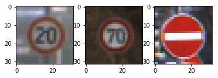
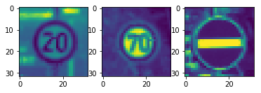
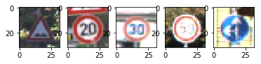

# **Traffic Sign Recognition** 

Here is a link to my [project code](https://github.com/placeforyiming/TrafficSignWithLeNet/blob/master/Traffic_Sign_Classifier.ipynb)

### Data Set Summary & Exploration

#### 1. Provide a basic summary of the data set. In the code, the analysis should be done using python, numpy and/or pandas methods rather than hardcoding results manually.

I used the numpy library to calculate summary statistics of the traffic
signs data set:

* The size of training set is 34799.
* The size of the validation set is 4410.
* The size of test set is 12630.
* The shape of a traffic sign image is (32,32,3).
* The number of unique classes/labels in the data set is 43.

#### 2. Include an exploratory visualization of the dataset.

Here is an exploratory visualization of the data set. It is a set with three images which are seperately coming from train, validation and test dataset. 

### Design and Test a Model Architecture

#### 1. Describe how you preprocessed the image data. What techniques were chosen and why did you choose these techniques? Consider including images showing the output of each preprocessing technique. Pre-processing refers to techniques such as converting to grayscale, normalization, etc. (OPTIONAL: As described in the "Stand Out Suggestions" part of the rubric, if you generated additional data for training, describe why you decided to generate additional data, how you generated the data, and provide example images of the additional data. Then describe the characteristics of the augmented training set like number of images in the set, number of images for each class, etc.)

As a first step, I decided to convert the images to grayscale and do the normalization on the greyscale image.

Here is an example of a traffic sign image before and after grayscaling.

The greyscale can reduce the dimension of input image. However I found this kind of change diminished the validation accuracy. So, I decided just do the normalization for the preprocessing part.

#### 2. Describe what your final model architecture looks like including model type, layers, layer sizes, connectivity, etc.) Consider including a diagram and/or table describing the final model.

My final model consisted of the following layers:

| Layer         		|     Description	        					| 
|:---------------------:|:---------------------------------------------:| 
| Input         		| 32x32x3 RGB image.   							| 
| Convolution 5x5     	| 1x1 stride, valid padding, outputs 28x28x6. 	|
| RELU					|												|
| Max pooling 2x2   	| 2x2 stride,  outputs 14x14x6.				    |
| Convolution 5x5	    | 1x1 stride, valid padding, outputs 10x10x16.  |	|
| RELU                  |                                               |
| Max pooling 2x2       | 2x2 stride,  outputs 5x5x16.                  |
| Fully connected		| Flatten, input 400, output 120.       		|	|
| Fully connected		| Input 120, output 84.        					|
| Fully connected		| Input 84, output 43.								
 

#### 3. Describe how you trained your model. The discussion can include the type of optimizer, the batch size, number of epochs and any hyperparameters such as learning rate.

To train the model, I used an AdamOptimizer with learning rate 0.0003. The size of batch is 15, and I trained this model for 15 epoch.

#### 4. Describe the approach taken for finding a solution and getting the validation set accuracy to be at least 0.93. Include in the discussion the results on the training, validation and test sets and where in the code these were calculated. Your approach may have been an iterative process, in which case, outline the steps you took to get to the final solution and why you chose those steps. Perhaps your solution involved an already well known implementation or architecture. In this case, discuss why you think the architecture is suitable for the current problem.

My final model results were:

* training set accuracy of 0.997528
* validation set accuracy of 0.930148
* test set accuracy of 0.913278

I have tried different version of hyperparameters and almost all the parameters worked well on the trainning set. After trainning, I ran the model on the validation set. If the accuracy on validation set is smaller than 0.93, I went back to tune the hyperparameters. I have tried batch size with 32, 20, 15, and I also tried learning rate with 0.004, 0.0004, 0.0001, 0.0003. Finally, the validation accuracy went beyond 0.93, and the test accuracy was also pretty good.      
 

### Test a Model on New Images

#### 1. Choose five German traffic signs found on the web and provide them in the report. For each image, discuss what quality or qualities might be difficult to classify.

Here are five German traffic signs that I found on the web:

#### 2. Discuss the model's predictions on these new traffic signs and compare the results to predicting on the test set. At a minimum, discuss what the predictions were, the accuracy on these new predictions, and compare the accuracy to the accuracy on the test set (OPTIONAL: Discuss the results in more detail as described in the "Stand Out Suggestions" part of the rubric).

Here are the results of the prediction:

| Image			        |     Prediction	        					| 
|:---------------------:|:---------------------------------------------:| 
| Bumpy road     		| Bumpy road   									| 
| Speed limit (20km/h)  | Speed limit (20km/h)							|
| Speed limit (30km/h)	| Speed limit (30km/h)							|
| Speed limit (50km/h)	| Speed limit (50km/h)			 				|
| Go straight or left	| Go straight or left     						|

The model was able to correctly guess 5 of the 5 traffic signs, which gives an accuracy of 100%. 

#### 3. Describe how certain the model is when predicting on each of the five new images by looking at the softmax probabilities for each prediction. Provide the top 5 softmax probabilities for each image along with the sign type of each probability. (OPTIONAL: as described in the "Stand Out Suggestions" part of the rubric, visualizations can also be provided such as bar charts)

For the all the five images, the model is pretty sure the class of each image. Here is the probability for the most possible class.

| Probability         	|     Which Image	        					| 
|:---------------------:|:---------------------------------------------:| 
| .9989        			| Image1: Bumpy road  						    | 
| .9999     			| Image2:Speed limit (20km/h)					|
| 1.					| Image3:Speed limit (30km/h)					|
| 1.	      			| Image4:Speed limit (50km/h)					|
| 1.				    | Image5:Go straight or left      				|

### (Optional) Visualizing the Neural Network (See Step 4 of the Ipython notebook for more details)
#### 1. Discuss the visual output of your trained network's feature maps. What characteristics did the neural network use to make classifications?

