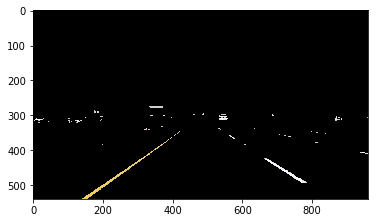
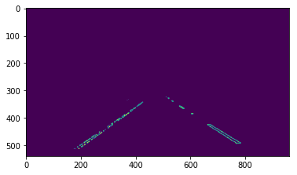
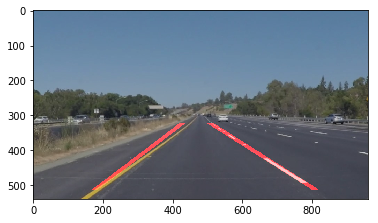

# **Finding Lane Lines on the Road** 

## Writeup Template

### You can use this file as a template for your writeup if you want to submit it as a markdown file. But feel free to use some other method and submit a pdf if you prefer.

---

**Finding Lane Lines on the Road**

The goals / steps of this project are the following:
* Make a pipeline that finds lane lines on the road
* Reflect on your work in a written report

[//]: # (Image References)

[image1]: ./examples/grayscale.jpg "Grayscale"

---

### Reflection

### 1. Describe your pipeline. As part of the description, explain how you modified the draw_lines() function.

#### Step 1: 
I imported an image as the tester of my functions. Here is the image:

#### Step 2:
I built a color filter to select those certain pixels which are yellow or white.

#### Step 3:
I applied grayscale function and then used canny edge detector to draw the outline of things in the image. The gaussian_blur was used on the output image to make it smooth.

#### Step 4:
I chose the certain region which is most possible for the line in the image.

#### Step 5:
In this step, I use cv2.HoughLinesP to output the start and end points for each line. By drawing those lines in the original image, we get this.

#### Modified draw_lines() function
In order to get a better result, I use cv2.HoughLines to get $\theta$ and $\rho$, then I seperate those parameters to two classes in terms of the sign of slope. For each class, I calculate the average of those two parameters and draw them on the image.

### 2. Identify potential shortcomings with your current pipeline

One potential shortcoming would be the position of the line is not exactly the same with the real marker. Sometimes, if there is another line appear in the image, the result will change dramaticly which would be harmful for the car.

### 3. Suggest possible improvements to your pipeline

A possible improvement would be to recognize the marker more robust.

